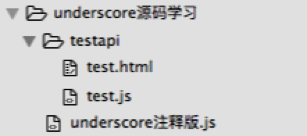

# 源码学习

> 项目结构，两种方式：
>   1. 不在本项目中，引用项目地址 eg:node.js 之 module.js
>   2. 在本项目中，eg:underscore.js  
>     
	其中，testapi文件夹 为测试源码 API 所用，无实际意义。
	underscore注释版.js 为学习材料，有完整注释。

### `node.js 之 module.js`
项目地址 ：[node.js-module](https://github.com/JiayiLi/node.js-module)  有完整注释； 
系统知识梳理：[【 js 模块加载 】深入学习模块化加载（node.js 模块源码）](http://www.cnblogs.com/lijiayi/p/js_node_module.html) 

### `underscore.js`
**JavaScript 工具库**

知识点梳理：
- [【 js 基础 】 深浅拷贝](http://www.cnblogs.com/lijiayi/p/jsdeeepcopy.html)
- [【 js 性能优化】underscore throttle 与 debounce 节流](http://www.cnblogs.com/lijiayi/p/jsoptimise1.html)

看完 underscore 建议阅读书籍《javascript函数式编程》

### `zepto.js`
**轻量级的针对现代高级浏览器的JavaScript库,与jquery有着类似的api**

知识点梳理：
- [【 js 基础 】【 源码学习 】 setTimeout(fn, 0) 的作用](http://www.cnblogs.com/lijiayi/p/setTimeout0.html)

学习资料推荐：
[zepto对象思想与源码分析](https://www.kancloud.cn/wangfupeng/zepto-design-srouce/173682)

### `backbone.js`
**以类jq和underscore为基础的mvc框架**
知识点梳理：
- [【 js 基础 】【 源码学习 】backbone 源码阅读（一）](http://www.cnblogs.com/lijiayi/p/backbone1.html) (1、MVC 框架
2、观察者模式 以及 控制反转)
- [【 js 基础 】【 源码学习 】backbone 源码阅读（二）](http://www.cnblogs.com/lijiayi/p/backbone2.html) (1、控制反转、依赖注入)
- [【 js 基础 】【 源码学习 】backbone 源码阅读（三）](http://www.cnblogs.com/lijiayi/p/backbone3.html) (浅谈 REST 和 CRUD)

------

综合 以上：
[【 js 基础 】【 源码学习 】源码设计 （zepto、underscore、backbone）](http://www.cnblogs.com/lijiayi/p/sourcecode.html)  `更新了bacbone设计于8月12日`

--------

###  advice
- 邮箱：<jiayi_li10@163.com>

### catch me
- 知乎：[李佳怡](https://www.zhihu.com/people/jiayi-0526)
- 知乎专栏：[李佳怡的纸糊](https://zhuanlan.zhihu.com/front-end-web) 专注于前端知识，学一点，就确保搞懂一点。
- 博客园：[TristaLee](http://www.cnblogs.com/lijiayi/)
- 公众号：佳怡所思（ljyFEer）是前端，也不只是前端。 
 

